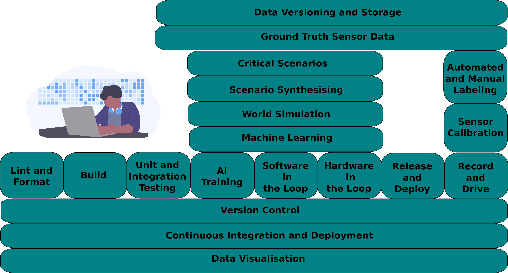

Protontypes offers long time experiences in the application of open source tooling for product development in the section of robotics, big data, software testing, autonomous driving and many other domains. This knowledge is already documented and maintained in the [awesome-robotic-tooling](https://github.com/Ly0n/awesome-robotic-tooling) list by Protontypes. The list grew to one of the major entry points for developers and organizations in the exchange of robotic tooling.

The goal of Protontypes is to create an open reference development environment platform that can be adapted and customized for start-ups and companies.

We support you in establishing complex continuous integration and deployment development environments adapted from autonomous logistic. [[1]](https://www.missinglinkelectronics.com/www/images/LandingPage/FPGA4ADAS_2/9_Augspurger_StreetScooter_Open-Source-System-Prototyping-in-Autonomous-Logistics.pdf)
